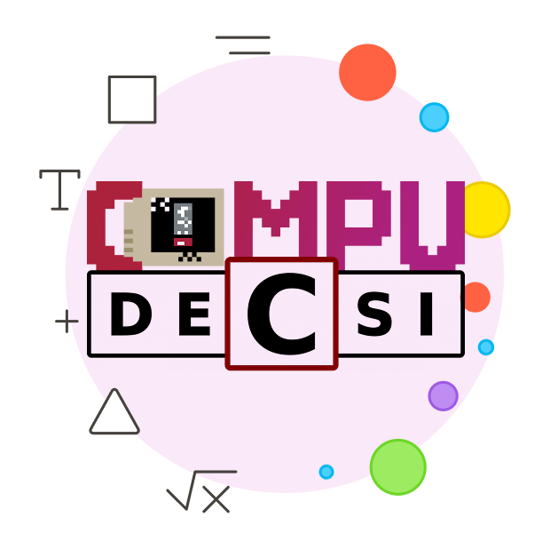

<div align="center">


<strong>CompuDECSI</strong>

[](#)
[](#)
[](#)
[](#)
</div>

---

CompuDECSI is a comprehensive mobile application designed for managing and participating in computer science events. Built with Flutter and Firebase, it provides a seamless experience for event organizers and attendees alike.

---

## Features

### Core Functionality
- **Event Management**: Create, edit, and manage computer science events
- **User Authentication**: Secure Google Sign-In integration
- **Real-time Updates**: Live event information and notifications
- **QR Code Integration**: Easy check-in system for event attendees
- **Category Filtering**: Organize events by computer science domains


### Technical Features
- **Cross-platform**: Built with Flutter for Android and iOS
- **Cloud Backend**: Firebase Firestore for real-time data
- **Push Notifications**: Keep users informed about events
- **Offline Support**: Basic functionality without internet connection
- **Responsive Design**: Optimized for various screen sizes

---

## Quick Start

For developers who want to run the project locally, please refer to the contributing tab for detailed setup guide.

For detailed information about specific configurations and features implementations refer to the [complete documentation](docs/README.md) provided

---

## Technology Stack

- **Frontend**: Flutter & Dart
- **Backend**: Firebase (Firestore, Authentication, Cloud Messaging)
- **State Management**: Flutter's built-in state management
- **UI/UX**: Material Design 3
- **Authentication**: Google Sign-In
- **Notifications**: Firebase Cloud Messaging
- **QR Code**: Mobile Scanner integration

---

## Project Structure

```
lib/
├── admin/           # Admin-specific functionality
├── models/          # Data models (User, Question, Feedback)
├── pages/           # Main app screens
├── services/        # Business logic and API calls
├── utils/           # Utility functions and helpers
├── widgets/         # Reusable UI components
└── main.dart        # App entry point
```

---
